<!-- Generated by src/build.py from src/content.py. Edit those, not this. -->

<a href="https://www.rudhresh.com"><picture><source media="(max-width: 600px)" srcset="assets/hero-m.svg"></picture></a>

<picture><source media="(max-width: 600px) and (prefers-color-scheme: dark)" srcset="assets/statement-m-dark.svg"><source media="(max-width: 600px)" srcset="assets/statement-m-light.svg"><source media="(prefers-color-scheme: dark)" srcset="assets/statement-dark.svg"></picture>

<picture><source media="(max-width: 600px) and (prefers-color-scheme: dark)" srcset="assets/how-i-build-m-dark.svg"><source media="(max-width: 600px)" srcset="assets/how-i-build-m-light.svg"><source media="(prefers-color-scheme: dark)" srcset="assets/how-i-build-dark.svg"></picture>

<a href="https://www.rudhresh.com/work"><picture><source media="(max-width: 600px) and (prefers-color-scheme: dark)" srcset="assets/selected-work-m-dark.svg"><source media="(max-width: 600px)" srcset="assets/selected-work-m-light.svg"><source media="(prefers-color-scheme: dark)" srcset="assets/selected-work-dark.svg">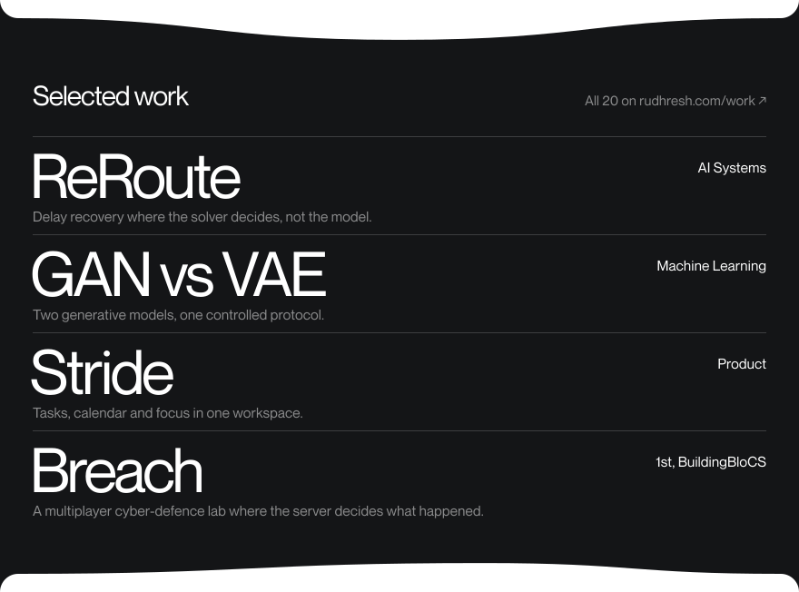</picture></a>

<picture><source media="(max-width: 600px) and (prefers-color-scheme: dark)" srcset="assets/cat-work-m-dark.svg"><source media="(max-width: 600px)" srcset="assets/cat-work-m-light.svg"><source media="(prefers-color-scheme: dark)" srcset="assets/cat-work-dark.svg"></picture>
<a href="https://www.rudhresh.com/work/builderlab"><picture><source media="(max-width: 600px) and (prefers-color-scheme: dark)" srcset="assets/p-builderlab-m-dark.svg"><source media="(max-width: 600px)" srcset="assets/p-builderlab-m-light.svg"><source media="(prefers-color-scheme: dark)" srcset="assets/p-builderlab-dark.svg"></picture></a>
<a href="https://www.rudhresh.com/work/bookmyshow"><picture><source media="(max-width: 600px) and (prefers-color-scheme: dark)" srcset="assets/p-bookmyshow-m-dark.svg"><source media="(max-width: 600px)" srcset="assets/p-bookmyshow-m-light.svg"><source media="(prefers-color-scheme: dark)" srcset="assets/p-bookmyshow-dark.svg"></picture></a>

<picture><source media="(max-width: 600px) and (prefers-color-scheme: dark)" srcset="assets/cat-hackathons-m-dark.svg"><source media="(max-width: 600px)" srcset="assets/cat-hackathons-m-light.svg"><source media="(prefers-color-scheme: dark)" srcset="assets/cat-hackathons-dark.svg"></picture>
<a href="https://www.rudhresh.com/work/reroute"><picture><source media="(max-width: 600px) and (prefers-color-scheme: dark)" srcset="assets/p-reroute-m-dark.svg"><source media="(max-width: 600px)" srcset="assets/p-reroute-m-light.svg"><source media="(prefers-color-scheme: dark)" srcset="assets/p-reroute-dark.svg"></picture></a>
<a href="https://www.rudhresh.com/work/breach"><picture><source media="(max-width: 600px) and (prefers-color-scheme: dark)" srcset="assets/p-breach-m-dark.svg"><source media="(max-width: 600px)" srcset="assets/p-breach-m-light.svg"><source media="(prefers-color-scheme: dark)" srcset="assets/p-breach-dark.svg"></picture></a>
<a href="https://www.rudhresh.com/work/remember"><picture><source media="(max-width: 600px) and (prefers-color-scheme: dark)" srcset="assets/p-remember-m-dark.svg"><source media="(max-width: 600px)" srcset="assets/p-remember-m-light.svg"><source media="(prefers-color-scheme: dark)" srcset="assets/p-remember-dark.svg"></picture></a>
<a href="https://www.rudhresh.com/work/orin"><picture><source media="(max-width: 600px) and (prefers-color-scheme: dark)" srcset="assets/p-orin-m-dark.svg"><source media="(max-width: 600px)" srcset="assets/p-orin-m-light.svg"><source media="(prefers-color-scheme: dark)" srcset="assets/p-orin-dark.svg"></picture></a>
<a href="https://www.rudhresh.com/work/orgis"><picture><source media="(max-width: 600px) and (prefers-color-scheme: dark)" srcset="assets/p-orgis-m-dark.svg"><source media="(max-width: 600px)" srcset="assets/p-orgis-m-light.svg"><source media="(prefers-color-scheme: dark)" srcset="assets/p-orgis-dark.svg"></picture></a>

Code: <a href="https://github.com/rudybrrr/psa-cs-ministryofmeat">ReRoute</a>, <a href="https://github.com/Inferno1172/Pygame_P17">Breach</a>, <a href="https://github.com/pufferfish3e/daytona-hacakthon">Remember</a>, <a href="https://github.com/pufferfish3e/pushtoprodjava">Orin</a>, <a href="https://github.com/rudybrrr/straight-up-hackathon-ybg">ORGIS</a>

<picture><source media="(max-width: 600px) and (prefers-color-scheme: dark)" srcset="assets/cat-products-m-dark.svg"><source media="(max-width: 600px)" srcset="assets/cat-products-m-light.svg"><source media="(prefers-color-scheme: dark)" srcset="assets/cat-products-dark.svg"></picture>
<a href="https://www.rudhresh.com/work/stride"><picture><source media="(max-width: 600px) and (prefers-color-scheme: dark)" srcset="assets/p-stride-m-dark.svg"><source media="(max-width: 600px)" srcset="assets/p-stride-m-light.svg"><source media="(prefers-color-scheme: dark)" srcset="assets/p-stride-dark.svg"></picture></a>
<a href="https://www.rudhresh.com/work/cosmic-quest"><picture><source media="(max-width: 600px) and (prefers-color-scheme: dark)" srcset="assets/p-cosmic-quest-m-dark.svg"><source media="(max-width: 600px)" srcset="assets/p-cosmic-quest-m-light.svg"><source media="(prefers-color-scheme: dark)" srcset="assets/p-cosmic-quest-dark.svg"></picture></a>

Code: <a href="https://github.com/rudybrrr/stride">Stride</a>, <a href="https://github.com/rudybrrr/cosmic-quest">Cosmic Quest</a>

<picture><source media="(max-width: 600px) and (prefers-color-scheme: dark)" srcset="assets/cat-ml-m-dark.svg"><source media="(max-width: 600px)" srcset="assets/cat-ml-m-light.svg"><source media="(prefers-color-scheme: dark)" srcset="assets/cat-ml-dark.svg"></picture>
<a href="https://www.rudhresh.com/work/gan-vs-vae"><picture><source media="(max-width: 600px) and (prefers-color-scheme: dark)" srcset="assets/p-gan-vs-vae-m-dark.svg"><source media="(max-width: 600px)" srcset="assets/p-gan-vs-vae-m-light.svg"><source media="(prefers-color-scheme: dark)" srcset="assets/p-gan-vs-vae-dark.svg"></picture></a>
<a href="https://www.rudhresh.com/work/kuzushiji-ocr-cnn-vs-crnn"><picture><source media="(max-width: 600px) and (prefers-color-scheme: dark)" srcset="assets/p-kuzushiji-ocr-cnn-vs-crnn-m-dark.svg"><source media="(max-width: 600px)" srcset="assets/p-kuzushiji-ocr-cnn-vs-crnn-m-light.svg"><source media="(prefers-color-scheme: dark)" srcset="assets/p-kuzushiji-ocr-cnn-vs-crnn-dark.svg"></picture></a>
<a href="https://www.rudhresh.com/work/pendulum-dqn-gravity-control"><picture><source media="(max-width: 600px) and (prefers-color-scheme: dark)" srcset="assets/p-pendulum-dqn-gravity-control-m-dark.svg"><source media="(max-width: 600px)" srcset="assets/p-pendulum-dqn-gravity-control-m-light.svg"><source media="(prefers-color-scheme: dark)" srcset="assets/p-pendulum-dqn-gravity-control-dark.svg"></picture></a>
<a href="https://www.rudhresh.com/work/multilingual-pizza-review-sentiment-rnn"><picture><source media="(max-width: 600px) and (prefers-color-scheme: dark)" srcset="assets/p-multilingual-pizza-review-sentiment-rnn-m-dark.svg"><source media="(max-width: 600px)" srcset="assets/p-multilingual-pizza-review-sentiment-rnn-m-light.svg"><source media="(prefers-color-scheme: dark)" srcset="assets/p-multilingual-pizza-review-sentiment-rnn-dark.svg"></picture></a>
<a href="https://www.rudhresh.com/work/handwritten-letter-classification-cnn"><picture><source media="(max-width: 600px) and (prefers-color-scheme: dark)" srcset="assets/p-handwritten-letter-classification-cnn-m-dark.svg"><source media="(max-width: 600px)" srcset="assets/p-handwritten-letter-classification-cnn-m-light.svg"><source media="(prefers-color-scheme: dark)" srcset="assets/p-handwritten-letter-classification-cnn-dark.svg"></picture></a>
<a href="https://www.rudhresh.com/work/applied-machine-learning"><picture><source media="(max-width: 600px) and (prefers-color-scheme: dark)" srcset="assets/p-applied-machine-learning-m-dark.svg"><source media="(max-width: 600px)" srcset="assets/p-applied-machine-learning-m-light.svg"><source media="(prefers-color-scheme: dark)" srcset="assets/p-applied-machine-learning-dark.svg"></picture></a>

Code: <a href="https://github.com/rudybrrr/cifar10-gan-vs-vae">GAN vs VAE</a>, <a href="https://github.com/rudybrrr/kuzushiji-ocr-cnn-vs-crnn">Kuzushiji OCR</a>, <a href="https://github.com/rudybrrr/pendulum-dqn-gravity-control">Pendulum DQN</a>, <a href="https://github.com/rudybrrr/multilingual-pizza-review-sentiment-rnn">Pizza Review Sentiment</a>, <a href="https://github.com/rudybrrr/handwritten-letter-classification-cnn">Handwritten Letter CNN</a>, <a href="https://github.com/rudybrrr/applied-machine-learning">Applied Machine Learning</a>

<picture><source media="(max-width: 600px) and (prefers-color-scheme: dark)" srcset="assets/cat-data-m-dark.svg"><source media="(max-width: 600px)" srcset="assets/cat-data-m-light.svg"><source media="(prefers-color-scheme: dark)" srcset="assets/cat-data-dark.svg"></picture>
<a href="https://www.rudhresh.com/work/client-portfolio-prioritisation"><picture><source media="(max-width: 600px) and (prefers-color-scheme: dark)" srcset="assets/p-client-portfolio-prioritisation-m-dark.svg"><source media="(max-width: 600px)" srcset="assets/p-client-portfolio-prioritisation-m-light.svg"><source media="(prefers-color-scheme: dark)" srcset="assets/p-client-portfolio-prioritisation-dark.svg"></picture></a>
<a href="https://www.rudhresh.com/work/career-and-labour-market-analysis"><picture><source media="(max-width: 600px) and (prefers-color-scheme: dark)" srcset="assets/p-career-and-labour-market-analysis-m-dark.svg"><source media="(max-width: 600px)" srcset="assets/p-career-and-labour-market-analysis-m-light.svg"><source media="(prefers-color-scheme: dark)" srcset="assets/p-career-and-labour-market-analysis-dark.svg"></picture></a>

Code: <a href="https://github.com/rudybrrr/it-systems-integrator-plotly-dashboard">Client Portfolio Prioritisation</a>, <a href="https://github.com/rudybrrr/career-and-labour-market-analysis">Career & Labour-Market Analysis</a>

<picture><source media="(max-width: 600px) and (prefers-color-scheme: dark)" srcset="assets/cat-workshop-m-dark.svg"><source media="(max-width: 600px)" srcset="assets/cat-workshop-m-light.svg"><source media="(prefers-color-scheme: dark)" srcset="assets/cat-workshop-dark.svg"></picture>
<a href="https://github.com/rudybrrr/restock-ai"><picture><source media="(max-width: 600px) and (prefers-color-scheme: dark)" srcset="assets/p-restock-ai-m-dark.svg"><source media="(max-width: 600px)" srcset="assets/p-restock-ai-m-light.svg"><source media="(prefers-color-scheme: dark)" srcset="assets/p-restock-ai-dark.svg"></picture></a>
<a href="https://github.com/rudybrrr/staged"><picture><source media="(max-width: 600px) and (prefers-color-scheme: dark)" srcset="assets/p-staged-m-dark.svg"><source media="(max-width: 600px)" srcset="assets/p-staged-m-light.svg"><source media="(prefers-color-scheme: dark)" srcset="assets/p-staged-dark.svg"></picture></a>
<a href="https://github.com/rudybrrr/spec-ingest-verify"><picture><source media="(max-width: 600px) and (prefers-color-scheme: dark)" srcset="assets/p-spec-ingest-verify-m-dark.svg"><source media="(max-width: 600px)" srcset="assets/p-spec-ingest-verify-m-light.svg"><source media="(prefers-color-scheme: dark)" srcset="assets/p-spec-ingest-verify-dark.svg"></picture></a>

<picture><source media="(max-width: 600px) and (prefers-color-scheme: dark)" srcset="assets/cat-stack-m-dark.svg"><source media="(max-width: 600px)" srcset="assets/cat-stack-m-light.svg"><source media="(prefers-color-scheme: dark)" srcset="assets/cat-stack-dark.svg"></picture>
<picture><source media="(max-width: 600px) and (prefers-color-scheme: dark)" srcset="assets/stack-m-dark.svg"><source media="(max-width: 600px)" srcset="assets/stack-m-light.svg"><source media="(prefers-color-scheme: dark)" srcset="assets/stack-dark.svg"></picture>

<picture><source media="(max-width: 600px) and (prefers-color-scheme: dark)" srcset="assets/along-m-dark.svg"><source media="(max-width: 600px)" srcset="assets/along-m-light.svg"><source media="(prefers-color-scheme: dark)" srcset="assets/along-dark.svg"></picture>

<a href="https://www.rudhresh.com/contact"><picture><source media="(max-width: 600px) and (prefers-color-scheme: dark)" srcset="assets/footer-m-dark.svg"><source media="(max-width: 600px)" srcset="assets/footer-m-light.svg"><source media="(prefers-color-scheme: dark)" srcset="assets/footer-dark.svg"></picture></a>

Write to <a href="mailto:rudy.rudhresh@gmail.com">rudy.rudhresh@gmail.com</a>, or find me on <a href="https://www.linkedin.com/in/rudhresh-r/">LinkedIn</a> and <a href="https://t.me/rudybrrr">Telegram</a>. Case studies live at <a href="https://www.rudhresh.com">rudhresh.com</a>.
