<!-- Generated by src/build.py from src/content.py. Edit those, not this. -->

<a href="https://www.rudhresh.com"><picture><source media="(max-width: 600px) and (prefers-color-scheme: dark)" srcset="assets/hero-dark-m.svg"><source media="(max-width: 600px)" srcset="assets/hero-light-m.svg"><source media="(prefers-color-scheme: dark)" srcset="assets/hero-dark.svg"></picture></a>

## Model details

- **Developed by:** Agne Rudhresh Ravichandran (goes by Rudy), Singapore
- **Model type:** Full-stack AI engineer: model, system, interface
- **Current checkpoint:** Founding Engineer at [BuilderLab](https://www.rudhresh.com/work/builderlab), Jul 2026 to now
- **Base model:** Applied AI & Analytics, Singapore Polytechnic (SP Scholar)
- **Languages:** Python, TypeScript, English
- **License:** Open to internships in full-stack AI
- **Card:** Case studies for everything below live at [rudhresh.com](https://www.rudhresh.com)

## Training

<picture><source media="(max-width: 600px) and (prefers-color-scheme: dark)" srcset="assets/training-dark-m.svg"><source media="(max-width: 600px)" srcset="assets/training-light-m.svg"><source media="(prefers-color-scheme: dark)" srcset="assets/training-dark.svg"></picture>

**Training data**

- Applied AI & Analytics at Singapore Polytechnic: 4.0 cGPA, six distinctions
- SP AI Club: Head of Operations, 6+ workshops of 30 to 60 students
- SP Outstanding Talent (SPOT): Leadership Development Coordinator, ExCo
- Singapore Youth AI: INSPIRE Coordinator, sessions of 110+ students
- Five hackathons in 2026, and counting

## Evaluation

| Benchmark | Result |
|---|---|
| cGPA, Applied AI & Analytics<br><sub>SP Scholar, six distinctions</sub> | **4.0** |
| Director’s Honour Roll<br><sub>School of Computing, AY2025/26</sub> | **Top 10%** |
| BuildingBloCS Game Jam 2026<br><sub>with [Breach](https://www.rudhresh.com/work/breach), a team of four</sub> | **1st**, CSIT category |
| ReRoute allocator vs median greedy<br><sub>expected preserved connections; synthetic benchmark, 2,500 worlds</sub> | **+4.12%** |
| ReRoute test suite<br><sub>541 backend, 104 frontend; they test the authority boundaries</sub> | **645** passing |

## Deployments

| Where | What it had to do |
|---|---|
| [**BuilderLab**](https://www.rudhresh.com/work/builderlab)<br><sub>Founding Engineer, Jul 2026 to now</sub> | Backend, architecture and security in a live codebase, where the paths that move money have to be right. |
| [**BookMyShow Southeast Asia**](https://www.rudhresh.com/work/bookmyshow)<br><sub>Access control, F1 Singapore GP 2025</sub> | Kept entry running at the Formula 1 Singapore Grand Prix, one networked scanner at a time. |

## Downstream tasks

Every project, grouped. Names open the case study; *code* opens the repo.

<details open>
<summary><b>Hackathons</b> &nbsp;5 &nbsp;<i>Built against the clock, judged on stage.</i></summary>

| Task | What it does |
|---|---|
| [**ReRoute**](https://www.rudhresh.com/work/reroute)<br><sub>[code](https://github.com/rudybrrr/psa-cs-ministryofmeat)</sub> | Recovers a transshipment plan after a late vessel, without letting the model pick the container.<br><sub>PSA Code Sprint 2.0, 2026</sub> |
| [**Breach**](https://www.rudhresh.com/work/breach)<br><sub>[code](https://github.com/Inferno1172/Pygame_P17)</sub> | A multiplayer cyber-defence lab where the server, not the players, decides what happened.<br><sub>BuildingBloCS 2026, 1st in CSIT</sub> |
| [**Remember**](https://www.rudhresh.com/work/remember)<br><sub>[code](https://github.com/pufferfish3e/daytona-hacakthon)</sub> | Brings a dormant GitHub app back to life in a sandbox, or refuses honestly when it can’t be made safe.<br><sub>Daytona HackSprint, 2026</sub> |
| [**Orin**](https://www.rudhresh.com/work/orin)<br><sub>[code](https://github.com/pufferfish3e/pushtoprodjava)</sub> | One meeting in, four briefings out, each built for what that role has to act on.<br><sub>Push to Prod, 2026</sub> |
| [**ORGIS**](https://www.rudhresh.com/work/orgis)<br><sub>[code](https://github.com/rudybrrr/straight-up-hackathon-ybg)</sub> | Every chat app in one queue, sorted by what needs a reply first.<br><sub>strAIght up!, 2026</sub> |

</details>

<details open>
<summary><b>Products</b> &nbsp;2 &nbsp;<i>Shipped end to end, auth to interface.</i></summary>

| Task | What it does |
|---|---|
| [**Stride**](https://www.rudhresh.com/work/stride)<br><sub>[code](https://github.com/rudybrrr/stride)</sub> | One workspace where a task, the time planned for it and the session spent on it are the same record.<br><sub>Independent, 2026</sub> |
| [**Cosmic Quest**](https://www.rudhresh.com/work/cosmic-quest)<br><sub>[code](https://github.com/rudybrrr/cosmic-quest)</sub> | A wellness game whose backend remembers every step you took to reach the next planet.<br><sub>Backend engineering, 2026</sub> |

</details>

<details>
<summary><b>Machine learning</b> &nbsp;6 &nbsp;<i>Controlled experiments before claims.</i></summary>

| Task | What it does |
|---|---|
| [**GAN vs VAE**](https://www.rudhresh.com/work/gan-vs-vae)<br><sub>[code](https://github.com/rudybrrr/cifar10-gan-vs-vae)</sub> | Two generative models judged by one protocol that was locked before either could win.<br><sub>CIFAR-10, two-person, 2026</sub> |
| [**Kuzushiji OCR**](https://www.rudhresh.com/work/kuzushiji-ocr-cnn-vs-crnn)<br><sub>[code](https://github.com/rudybrrr/kuzushiji-ocr-cnn-vs-crnn)</sub> | Does a recurrent layer help read cursive Japanese, and does the help grow with length?<br><sub>CNN vs CRNN, 2026</sub> |
| [**Pendulum DQN**](https://www.rudhresh.com/work/pendulum-dqn-gravity-control)<br><sub>[code](https://github.com/rudybrrr/pendulum-dqn-gravity-control)</sub> | Can one frozen DQN recipe balance a pendulum when gravity changes?<br><sub>Reinforcement learning, 2026</sub> |
| [**Pizza Review Sentiment**](https://www.rudhresh.com/work/multilingual-pizza-review-sentiment-rnn)<br><sub>[code](https://github.com/rudybrrr/multilingual-pizza-review-sentiment-rnn)</sub> | Three-way sentiment where the hard part is the middle.<br><sub>English and Malay, 2026</sub> |
| [**Handwritten Letter CNN**](https://www.rudhresh.com/work/handwritten-letter-classification-cnn)<br><sub>[code](https://github.com/rudybrrr/handwritten-letter-classification-cnn)</sub> | Twenty-six letters, from a dense baseline to a locked CNN.<br><sub>EMNIST letters, 2026</sub> |
| [**Applied Machine Learning**](https://www.rudhresh.com/work/applied-machine-learning)<br><sub>[code](https://github.com/rudybrrr/applied-machine-learning)</sub> | Baseline first, compare before choosing, then explain the choice.<br><sub>Four problem types, 2025</sub> |

</details>

<details>
<summary><b>Data and analytics</b> &nbsp;2 &nbsp;<i>Numbers read together, not ranked alone.</i></summary>

| Task | What it does |
|---|---|
| [**Client Portfolio Prioritisation**](https://www.rudhresh.com/work/client-portfolio-prioritisation)<br><sub>[code](https://github.com/rudybrrr/it-systems-integrator-plotly-dashboard)</sub> | Which clients to protect, grow, fix or question: nine charts that answer it as one story.<br><sub>Plotly and Dash, 2026</sub> |
| [**Career & Labour-Market Analysis**](https://www.rudhresh.com/work/career-and-labour-market-analysis)<br><sub>[code](https://github.com/rudybrrr/career-and-labour-market-analysis)</sub> | Pay, flexibility, demand and job security, read together rather than ranked on salary.<br><sub>Data analysis, 2025</sub> |

</details>

<details>
<summary><b>Still training</b> &nbsp;3 &nbsp;<i>Newer repos, not written up yet.</i></summary>

| Task | What it does |
|---|---|
| [**restock-ai**](https://github.com/rudybrrr/restock-ai) | Adaptive restaurant inventory and procurement agent.<br><sub>Python, 2026</sub> |
| [**staged**](https://github.com/rudybrrr/staged) | Local-first, cost-aware workbench for auditing AI-generated code changes before commit.<br><sub>TypeScript, 2026</sub> |
| [**spec-ingest-verify**](https://github.com/rudybrrr/spec-ingest-verify) | Specification ingestion and verification.<br><sub>Python, 2026</sub> |

</details>

> [!TIP]
> **There’s more than what’s on GitHub.** Some of my work lives in private repos or never had one. To know more about me, or see projects that aren’t here, head to [rudhresh.com](https://www.rudhresh.com) or email me at [rudy.rudhresh@gmail.com](mailto:rudy.rudhresh@gmail.com).

## Toolbox

<picture><source media="(max-width: 600px) and (prefers-color-scheme: dark)" srcset="assets/embedding-dark-m.svg"><source media="(max-width: 600px)" srcset="assets/embedding-light-m.svg"><source media="(prefers-color-scheme: dark)" srcset="assets/embedding-dark.svg"></picture>

## Intended use

- Internships in full-stack AI, from the model to the interface.
- Backend and systems work where the failure paths matter: money, access, safety.
- Hackathon teams whose demo has to actually run on stage.

**Out of scope**

- Letting a language model make the final call on anything expensive. The model proposes; the system decides.
- Claims without a baseline.

## Limitations and biases

- “A man who has not hit his Claude limit by noon has wasted his morning.” (Aristotle, probably.) Usually hit before noon.
- Latency rises on ride nights. Longest run so far: 101 km in 4:59:56.
- Will ask what the baseline is. Then what the p90 is.
- Trained mostly on Singapore data; generalises with context.

## How to use

```python
from rudy import Rudy

rudy = Rudy.from_pretrained("rudybrrr/rudy")
rudy.contact(email="rudy.rudhresh@gmail.com")  # also LinkedIn, Telegram
```

[Email](mailto:rudy.rudhresh@gmail.com) &nbsp;·&nbsp; [LinkedIn](https://www.linkedin.com/in/rudhresh-r/) &nbsp;·&nbsp; [Telegram](https://t.me/rudybrrr) &nbsp;·&nbsp; [rudhresh.com](https://www.rudhresh.com)

## Citation

```bibtex
@misc{ravichandran2026rudy,
  author = {Ravichandran, Agne Rudhresh},
  title  = {Rudy: a full-stack AI engineer},
  year   = {2026},
  note   = {Open to internships},
  url    = {https://www.rudhresh.com}
}
```

<picture><source media="(max-width: 600px) and (prefers-color-scheme: dark)" srcset="assets/eot-dark-m.svg"><source media="(max-width: 600px)" srcset="assets/eot-light-m.svg"><source media="(prefers-color-scheme: dark)" srcset="assets/eot-dark.svg"></picture>
